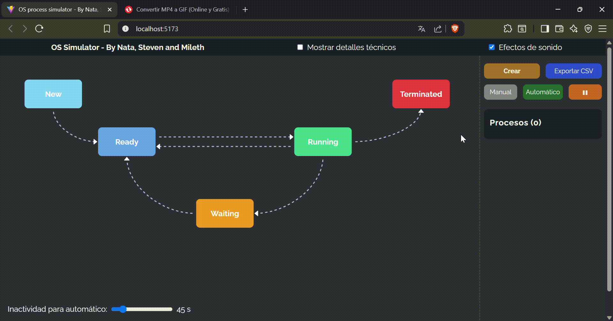

# Manual de usuario: Simulador de Ciclo de Vida de Procesos

Simulador web que modela los estados **New → Ready → Running → Waiting → Terminated** de procesos en un sistema operativo.  
Permite modo **manual** y **automático**, control de velocidad y exportación de historial en formato CSV.

## Requisitos Previos

Antes de instalar la aplicación, asegúrate de tener:

- **Node.js** >= 20.12  
  [Descargar Node.js](https://nodejs.org/)
- **npm** (ya viene incluido con Node)

## Instalación

```bash
# 1. Clona el repositorio de GitHub en una carpeta local:
    git clone https://github.com/Steven-Leon-007/os_process_simulator

# 2. Entra en la carpeta raiz del proyecto:
    cd carpeta-raiz-proyecto

# 3. Instala las dependencias
npm install

# 4. Inicia servidor de desarrollo
npm run dev

# El proyecto quedará disponible en http://localhost:5173

```

## Glosario de Términos

| Término   | Significado                                                                 |
| --------- | --------------------------------------------------------------------------- |
| PID       | Identificador único de proceso.                                             |
| Estado    | Situación actual del proceso (New, Ready, Running, Waiting, Terminated).    |
| Quantum   | Tiempo máximo que un proceso permanece en Running.                          |
| Prioridad | Valor entre 0 y 9 que decide qué proceso recibe CPU primero (9 = más alta). |

## Guía de Uso

**Crear un proceso**  
Clic en **Crear**. El proceso aparece en estado _New_. Si esta en modo automático, se crearán procesos nuevos aleatorios cada 7 segundos

**Modo Manual / Automático**  
Usa el interruptor:

- _Manual_: cada transición se realiza con los botones.
- _Automático_: el motor avanza según tiempos predefinidos.

**Control de velocidad**  
Ajusta el deslizador para cambiar la frecuencia de avance en modo automático.

**Avance de estados (modo manual)**

- Admitir (New → Ready)
- Asignar CPU (Ready → Running)
- Solicitar I/O (Running → Waiting)
- Completar I/O (Waiting → Ready)
- Terminar (Running → Terminated)

**Exportar historial**  
Clic en **Descargar CSV** para descargar el historial de transiciones de cada proceso.

## Interfaz de Usuario

- **Barra de Controles:** Crear procesos, alternar modo, ajustar velocidad, exportar historial, pausar o reanudar.
- **Diagrama de Estados:** Vista gráfica de los procesos ubicados en su estado actual.
- **Panel de Detalles:** Información del proceso seleccionado:
  - PID
  - Estado actual
  - Historial de transiciones (from, to, timestamp, cause, duration)

## Modos de Operación

| Estado  | Tiempo (ms) |
| ------- | ----------- |
| New     | 1000        |
| Ready   | 0           |
| Running | 3000        |
| Waiting | 2000        |

- _Manual_: el usuario controla cada transición.
- _Automático_: el motor evalúa elapsed y avanza cuando se cumple el tiempo mínimo.

El scheduler asigna CPU al proceso con mayor prioridad en Ready.

## 🔧 Configuración Avanzada

Puedes ajustar los tiempos en `src/services/engine.js`:

```js
const DURATIONS = {
  New: 1000, // 1 segundo en estado New
  Ready: 0,
  Running: 3000, // quantum de CPU
  Waiting: 2000, // espera por I/O
};
```

## Ejemplo de Flujo

1. Crear 3 procesos con prioridades 2, 5 y 8.
2. Activar Modo Automático y velocidad normal.
3. Observar cómo el proceso de prioridad 8 pasa a Running primero.
4. Esperar a que terminen o pidan I/O según el quantum.
5. Descargar historial en CSV.

## Solución de Problemas

| Problema              | Posible Causa / Solución                                      |
| --------------------- | ------------------------------------------------------------- |
| El motor no avanza    | Verifica que estés en modo automático y que la velocidad > 0. |
| La app no inicia      | Asegúrate de tener Node.js y npm instalados.                  |
| No descarga CSV       | Revisa permisos del navegador y pop-ups.                      |
| Cambios no reflejados | Refresca la página; verifica consola por errores.             |

## Recursos Visuales

Puedes incluir capturas de pantalla o GIFs mostrando:

- Crear proceso.
  

- Avance de estados.
  

- Exportación CSV.
  

## Stack Tecnológico

- React 19 + Vite
- Motion para animaciones
- Papaparse para exportación CSV
- Howler.js para sonidos de eventos
- Vitest + Testing Library para pruebas

## Créditos

- Steven Leon – UI y Diseño
- Natalia Bernal – FSM y QA
- Mileth Martinez – Motor de Simulación y Reportes
